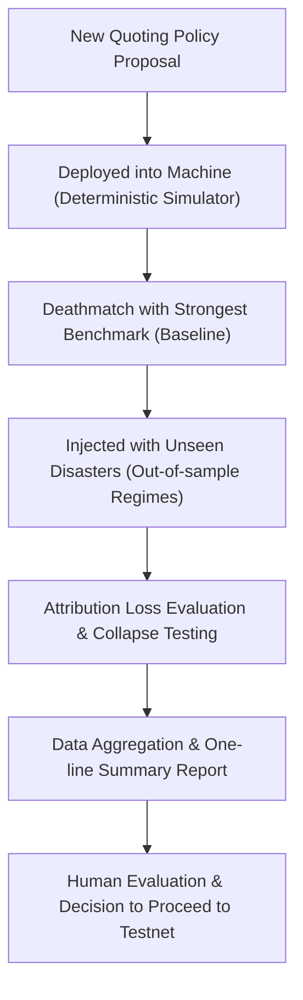

# LIFLUCT Whitepaper

**Author:** [Sunchul Jung](mailto:zotanika@gmail.com)
**Github Repo:** [https://github.com/zotanika/lifluct](https://github.com/zotanika/lifluct)

## Abstract

**[LIFLUCT](https://github.com/zotanika/lifluct)** is an open-source policy lab built to evaluate how liquidity policies perform in adversarial market environments.

The project began with a difficult question:
> **"Could an automated liquidity system outperform a market maker fixed on a single strategy by adjusting its quoting policy in real-time against toxic order flow?"**

Answering this question required massive-scale simulations and rigorous adjudication. To put it simply, "adaptive market making" does not yield an unconditional victory. When factoring in the costs of experimenting with new policies on shared liquidity, the structural reality where markets ruthlessly target the weakest policy, and the astonishing defensive capabilities of a well-crafted fixed baseline policy—making a system "real-time evolutionary" proved far more dangerous and complex than anticipated.

Today, the goal of LIFLUCT is not to prove that a specific mechanism is inherently profitable. A far more important objective is to provide a rigorous stage where anyone can objectively verify claims like, "Is this liquidity policy truly superior?" To this end, LIFLUCT provides deterministic simulation, confrontation against formidable baselines, best-fixed policy search, out-of-sample regime evaluation, attribution robustness analysis, failure-mode reporting, and large-scale adjudication workflows.

This whitepaper walks through where the LIFLUCT project started, what it learned, the technical milestones it has reached, and why its academic and technical contributions represent a fascinating story even for general readers outside the blockchain ecosystem.

## 1. Why This Project Exists

Automated Market Makers (AMMs) are often simply described as "markets driven by a single mathematical formula." But reality is never that simple.

An AMM is a system that ceaselessly calculates trading prices based on the assets held in a liquidity pool. Liquidity providers (LPs) supply the capital, traders interact with that capital, and arbitrageurs exploit price discrepancies with external markets to realize profits, simultaneously realigning the pool's price with the outside world. Oracles act as messengers, relentlessly delivering external reference prices. In short, the final economic report card of this complex system is not determined by a single invariant or a fee schedule. It heavily depends on how countless participants and observations interact.

If you are new to this field, here are three key takeaways:
- An AMM is not just a curve drawn by an equation.
- It is a "market-making policy" operating on top of people's capital.
- Depending on market conditions, this policy can be brilliant, terrible, highly vulnerable to external attacks, or solidly defensive.

LIFLUCT was born because much of the research and many product announcements in this space still suffer from the following flaws:
- Weakly established competitors (poor baselines).
- Test results derived strictly from favorable conditions (in-sample overfitting).
- Unfavorable assumptions buried deep in the footnotes of papers.
- Inadequate reporting on failure scenarios.
- Marketing heavily reliant on flashy buzzwords like "Adaptive" or "Intelligent."

LIFLUCT is an attempt to push aside these romanticized practices and drag market making into the realm of rigorous, cold evaluation.

## 2. The Origin of the Project

LIFLUCT started from a rather bold hypothesis.

> **"Instead of betting fate on a single fixed strategy, what if a massive liquidity pool were partitioned among multiple quoting policy modules?"**

One module might aggressively adjust fees, while another acts conservatively, suspecting the oracle of delayed pricing. The most ambitious scenario envisioned a self-training, evolving system where unprofitable, weak policies naturally perish and robust policies are cloned.

This intuition is theoretically very attractive:
- Real market environments are never static.
- Toxic order flows do not occur at predictable intervals; they strike suddenly.
- A single fixed strategy is too inflexible for such volatile conditions.
- A self-adapting liquidity pool could drastically reduce LPs' losses under extreme stress.

The fundamental question posed by this hypothesis was not simply to create an exotic financial protocol:
"Is a real-time adaptive liquidity policy structure truly worth the cost? Or is a single, highly refined fixed strategy, chiseled offline by humans, sufficient?"

This question remains highly valuable both academically and practically. However, the subsequent research revealed a reality vastly different from our initial expectations.

## 3. Lessons Learned from the Research

### 3.1 Experimentation incurs costs, and those costs are someone's real money
In typical machine learning systems, the failure experienced while "exploring" a new strategy results only in wasted computing resources. However, experimenting with half-baked policies on a liquidity pool containing real assets is an entirely different story.

If a system must inevitably expose various active policies to the market to find the best one, it is essentially serving visible prey to malicious traders in exchange for data. This directly slashes the LP balance sheet. Learning in a live market is thousands of times more expensive than learning in an offline lab.

### 3.2 Striking the weakest link is no coincidence
Imagine multiple types of quoting policies sharing a single asset and simultaneously presenting prices. Sophisticated, lightning-fast hunters (like arbitrageurs) do not engage these policies fairly. They laser-focus their attacks on the single policy with the weakest defense. (Weakest-link Dynamics).

This creates a severe structural asymmetry:
- The gains from the system discovering a superior quoting policy are slow and uncertain.
- Conversely, the losses incurred when just one fragile quoting policy is exposed are immediate and devastating.

Because of this characteristic, the burden of proof for the idea of a real-time adaptive liquidity system becomes exceptionally harsh.

### 3.3 A great baseline beats a flashy narrative
One of the greatest academic takeaways from this project is methodological.

It is incredibly easy to pit a new system against a slow, outdated competitor and declare, "We won overwhelmingly." But the narrative shifts entirely when the new system is made to take a mock exam against the "best-fixed policy"—the absolute best, highly optimized fixed policy computationally discovered from countless possibilities offline.

The moment this true heavyweight is brought into the ring, we witnessed many ambitious papers and ideas floating around the industry shatter against the wall of reality. This is why LIFLUCT makes establishing the best fixed policy as our baseline not an optional choice, but a primary obligation.

### 3.4 Our conclusion shifted toward realism
While the original idea of a self-evolving multi-policy system is fascinating, the most responsible conclusion we can share with practitioners and the public today is much more conservative.

- Rather than learning in real-time with real users' hard-earned money, it is far safer to deploy a single policy that has been ruthlessly trained in an offline lab.
- Rather than building an AI-like system that rewrites its own code, it is more responsible to design a "Guarded Deployment" system capable of dropping the shutters before taking fatal damage.
- Instead of grand technological narratives, this market desperately needs a consistent and rigorous performance verification system, even if it seems tedious.

Today's LIFLUCT is the judge built to embody this pragmatic, cold conclusion.

## 4. What is LIFLUCT Today?

LIFLUCT is not a "launch-ready exchange" that will rake in customers' money tomorrow. It is not a guaranteed check promising profit just by installing this software.

LIFLUCT is a toolkit—a professional research sandbox—built to measure and verify the stamina of liquidity policies under extremely adversarial market conditions.

Its current objective is crisp and clear:
"To help anyone transparently judge which liquidity policy from any bank, protocol, or researcher can survive the harshest carpet bombing."

Rather than just publishing a neat hypothesis in a paper, evolving it into a practical testbed that can carve, polish, and verify the safety of policies before deployment is the most significant contribution this project offers the world.

## 5. Blockchain Finance 101 for Non-Experts

For general readers unfamiliar with this field, let's briefly touch on the background of the blockchain ecosystem and how Automated Market Makers work.

### 5.1 What is a blockchain network?
A blockchain network isn’t a private data center hidden away by Amazon or Google. It’s a massive public calculator maintained by countless computers scattered across the globe, all sharing the operating costs and keeping the ledger.

Deploying an economic system on this network is quite intimidating. The rules and the store vault you designed are transparently open to anyone, and arbitrage bots somewhere in the world are looking for gaps in that vault 24 hours a day, down to the millisecond. Here, algorithmic code isn't just text on a whiteboard; it’s a frontline commander dropped straight into a blood-splattered, silent warzone.

### 5.2 What is a Smart Contract?
A smart contract is an unmanned, automated piece of code running on the blockchain.

In the context of AMMs, a smart contract performs these tasks:
- It securely holds real assets in the liquidity pool, preventing unauthorized access.
- It presents trading prices based on mathematical formulas.
- It executes trades and deducts fees from the customer's share.
- It flawlessly executes the transfer of capital between LPs, traders, and the exchange.

Once deployed, this code is extremely difficult to patch quietly like a smartphone app update. This is why pre-deployment evaluation and simulation are hundreds of times more critical than standard software development.

### 5.3 What is an Automated Market Maker (AMM)?
It is an exchange model that replaces the traditional "order book" method—where buyers and sellers list their desired prices—with mathematical formulas acting as the bank manager.

The most representative "Constant-Product" model works by stacking two types of assets (e.g., apples and bananas) in a transparent vault, causing the price tag to change based on scarcity.
- If someone buys a massive chunk of apples, the vault is left piled high with bananas, making apples rare.
- Consequently, when the next customer tries to buy an apple, the formula naturally demands a higher price.
- What if the vault's price formula malfunctions and sells them too cheaply? Professional arbitrageurs from the outside rush in, buy up the cheap stock, and flip it at the outside market's higher price. Thanks to their activity, the ratio of goods in the vault miraculously stays identical to the outside world's prices.

### 5.4 The Stakeholders
Strip away the arcane math, and the cast of characters is quite clear:

- Traders: Users looking to hand over bananas to buy apples.
- Liquidity Providers (LPs): The financiers who initially put their pocket money into the vault so the exchange can operate.
- Arbitrageurs: Roaring hunters monitoring domestic and international exchanges, swooping in to exploit dumb pricing at lightning speed to pocket the difference.
- Oracles: The messengers periodically delivering global prices (e.g., from Nasdaq, Binance) to communicate how much apples are currently trading for in the outside world.
- Protocol: The foundation that created this platform and laid down the overall rules.

All players form a small economic ecosystem, engaging in fierce mental battles to take the largest slice of pie from each other's pockets.

### 5.5 Do Liquidity Providers Really Enjoy Unearned Income?
Absolutely not. They are the ones braving the risks of Adverse Selection unprotected.

Imagine the outside price of apples skyrockets, but the messenger (Oracle) arrives slightly late, leaving the AMM still holding a cheap price tag. The fastest arbitrageur arrives and sweeps the AMM vault's cheap apples. The LP might earn a few pennies in fees per trade, but calculating the total value of the assets left in the warehouse shows they've already suffered massive paper losses. Do not be fooled by the phrase "High fee rates!" What matters is whether the business remains profitable *after* subtracting all these devastating losses.

### 5.6 Toxic Flow
In finance, the term 'toxic' does not imply malicious, immoral theft. It refers to a highly aggressive trading pattern structurally engineered to inflict losses on our vault.

For example:
- A buy order that perfectly exploits the split-second delay when market prices change.
- A bot that capitalizes the moment oracle prices temporarily glitch.
- Activities that concentrate bombing runs strictly on the weakest link in our multiple lines of defense.

This isn't an issue of good versus evil; it's the language of rigorous structural engineering stress tests.

### 5.7 Not Getting Fooled by Oracles (Information Networks)
For our vault to post smart price tags, it must know the "true price" of the outside world. However, the price data brought by the messenger (Oracle) is inevitably slow due to internet latency, occasionally filled with noise, and sometimes even manipulated.

What happens if our quoting policy blindly relies on these broken oracle numbers?
- We lock the gates when there's no need to defend (Over-reaction).
- We fail to raise fees even as enemies storm in (Under-reaction).
- We force absurdly unfavorable exchange rates on innocent everyday users.

Because of this, LIFLUCT views "How healthily does this policy withstand a slightly chaotic oracle?" (Attribution Robustness) not as an add-on feature, but as a core evaluation criterion.

### 5.8 The Gravity of Code "Deployment"
In a typical software company, deployment might be a minor event like enlarging font sizes or exposing a new button. On a blockchain, deployment is a heavy seal of approval that resets the laws of economic gravity.

- Once deployed, a smart contract is visible to everyone.
- It operates not with testnet play money, but with tens or hundreds of millions of dollars entrusted by customers.
- If the code is sloppy, liquidity isn't just a metaphor—it literally evaporates, and reputation plummets into the abyss.

This is why this whitepaper continuously uses terms like "Rollback Criteria" and "Approval Threshold." We are not asking, "Is this a neat idea?" We are asking, "Is this code defensive enough that you'd connect it to your daughter's bank account?"

### 5.9 Devnet, Testnet, Mainnet
These terms aren't server brand names; they signify the operational 'weight of responsibility.'

- Devnet: The stage where researchers tinker with Lego blocks in a university lab to see if the engine even turns on.
- Testnet: A rehearsal stage running for a month with fake money, showing a rough outline to the world.
- Mainnet: The real, unforgiving stage where actual wealth, incentives, and lethal attacks occur.

Lab papers often dress up numbers from devnets or simulations as if they were mainnet glory. LIFLUCT was built to bridge that gap with verifiable data.

## 6. The LIFLUCT System Map

From a bird's eye view, LIFLUCT is a clear pipeline that drops unproven candidates (quoting policies) into a boot camp and scores them.

### 6.1 How People in the Field Use It
Let’s translate how this tool is used into practical terms, outside of coding geniuses.

1. A team mathematician submits a document claiming, "Using this formula improves defense by 10%!"
2. The development team drops this formula into the LIFLUCT simulator and pits it against a strong benchmark.
3. After running countless extreme scenarios, they discover the formula entirely collapses during a specific market crash. (They found the problem without losing a single penny of customer money.)
4. They compare it against other candidates, document the most important risks, and decide whether it deserves further review.
5. Only then do they discuss whether the candidate is ready for narrower external testing.

In short, this tool isn't a printer for pretty sales charts. It's an impenetrable breakwater preventing half-baked ideas from wandering defenselessly into the wild.

## 7. Key System Components

### 7.1 Deterministic Simulator
The simulator is a staged mechanical replica of reality, built like an amusement park ride. It features market pools, oracles shouting external prices, inconsistent noise traders, and ruthlessly opportunistic arbitrage assassins.

The most critical feature is its "deterministic movement." If you input identical conditions as yesterday, it produces the exact same outcome without a millimeter of deviation today. This reproducibility must be guaranteed to analyze whether a loss was a stroke of bad luck or a flaw in the code.

### 7.2 Searching for the Top Champion (Best-fixed Policy Search)
LIFLUCT doesn't just copy a lagging competitor's code for a sparring match. It seeks out the absolute hardest, invincible formula pushed to the system's absolute limits from the single-policy formulas we can set, and uses that as the hurdle. It forces a "moderately smart system" to fight a "powerfully tuned brute system." Often, the boring, fixed formula wins comprehensively here. This feature provides the most painful, honest evaluation.

### 7.3 Regime Family Evaluation
Watching an umbrella merchant who thrives on rainy days and a sandal seller who thrives on sunny days for a single day won't tell you who the best merchant is. LIFLUCT supports harsh stage settings.

- When the information network is partially paralyzed
- When market volatility goes completely haywire
- When only the worst villains connect
- And random noise control modes to eliminate pure coincidence.

The final report card doesn't record a single dazzling success. It judges whether the policy trended upwards on average while surviving this gauntlet of gruesome regimes.

### 7.4 Efficient Record Keeping (Retention Mode)
Trying to save all 100,000 runs of yearly transaction histories would crush even Google-level servers. 
By supporting lightweight epoch summary modes and hybrid debug modes that dissect only fatal crashes, it allows researchers to focus on insights without being buried under a mountain of data trash.

### 7.5 Comprehensive Reporting and Decisive Adjudication
The reports spat out by this complex are an 180-degree departure from advertising flyers. Instead of flashy branding terms, it delivers verdicts in dry, objective academic language.

- Survives
- Mixed
- Fails
- Inconclusive

This decisiveness represents LIFLUCT's identity, an identity that remains unshaken by any dazzling formula.

## 8. Philosophy Behind Core Methodologies

### 8.1 Unshakeable Baseline Discipline
Many innovative papers pit themselves comfortably against outdated systems to prove their cleverness. However, LIFLUCT forces the deployment of a highly aggressively tuned 'Best Fixed Benchmark Model'. Any model failing to clear the basics is disqualified.

### 8.2 An Equally Cruel Stage (Fairness)
To compare multiple models, all conditions—volatility, villain activity rates, random number generators—must be mirrored exactly. Only then can the superiority of a model be purely evaluated.

### 8.3 Preventing Leaked Exam Papers (Train/Test Separation)
If a bot trained on market data from February 2024 is thrown back into the February 2024 market, it will naturally yield top 1% returns. LIFLUCT forcefully thrusts this bot into an entirely new phase of 2025 to weed out "fake perfect scorers" (parameter fitting).

### 8.4 Whose Fault is the Loss? (Attribution Robustness)
Calculating loss rates is prone to subjectivity. If a system’s ranking fluctuates wildly based on whether the reference price is current external time, a 5-minute average, or 10 seconds post-execution, the system isn't robust. LIFLUCT runs cross-checks against various criteria to ensure stability.

### 8.5 Failure-First Reporting
To LIFLUCT, a fatal failure (downtime, collapsed balance) is the most precious canary in the coal mine, far more valuable than an incorrect answer sheet.
Worst-case red flags—like fees evaporating into thin air, or the trading pie completely dying out due to overly defensive behavior—are permanently nailed to the front page of the report, forcing developers to face reality.

## 9. Measuring Performance (Key Metrics)

Skipping the math symbols, here's how we track the flow of money.

### 9.1 Price Deviation Rate
"By what percentage has our vault's price drifted from the market's true value?" We calculate the urgency using absolute values.

### 9.2 Dynamic Fee Adjustment
Simple. If the market deviation in the formula above widens too rapidly, the system throws up a barrier by sharply raising the arbitrage fee to block theft.

### 9.3 Perceived Trader Discomfort (Proxy)
An exchange is unappealing if it becomes robust by subjecting innocent traders to overly harsh execution rates or steep fees. We measure the balance—how high trader slippage and fees spiked while defense rates rose.

### 9.4 To HODL vs. To Market Make (LP Net Profit)
The most ruthless comparison: The value of leaving apples and bananas perfectly preserved at home for an entire year versus the remaining value after subjecting them to the harsh winters and warm winds of the AMM market for a year. 

## 10. Technical Contributions

From an engineering standpoint, this is a highly capable asset.

### 10.1 Lego Block Architecture
Information delivery, trading rules, loss settlement, and recording mechanisms are thoroughly modularized. This prevents the tragedy where altering a single piece of code spawns a bug in an entirely unrelated area.

### 10.2 Powerful Automation Plant
Includes a solid testing pipeline that scatters mock stages with tens of thousands of settings across multiple servers, running parallel calculations before retrieving only the compressed summary.

### 10.3 Pure Text Reports (Markdown)
Instead of locking away data behind a flashy graphical UI, it generates candid, easily verifiable markdown documents in text format. This enables direct sharing on developer ecosystems like GitHub, inviting open critique from other scholars.

## 11. Academic Contributions

Academically, this introduces fascinating shifts.

### 11.1 Measuring Stamina over Formulaic Elegance
Academia often tends to be drawn to elegant market-making formulas. LIFLUCT calmly asks: "So does this formula survive without dying when hit with toxic traffic from all sides and oracle information cuts out?"

### 11.2 Bringing Failures into the Light
In the blockchain community, anecdotes of protocol mechanisms collapsing are often just whispered secretly. This stack elevates the practice of putting a code's limits in the spotlight and communicating transparently to a gold standard.

### 11.3 Making Intangible Intuitions Visible
"Adverse selection, toxic traffic, oracle hacks..." LIFLUCT has translated these rumored tales and unquantifiable absurdities into tangible data code within a simulation environment. It’s akin to a forensic team's crime scene reconstruction.

## 12. Where the Project is Now

LIFLUCT is no longer just a sketch in a notebook or an example program for a paper.

It has evolved into a "Dedicated Liquidity Policy Evaluation Software" equipped with massive batch systems, rigid baseline competition structures, and a reporting framework. Moving away from sandboxing to create elegant formulas by excluding troublesome complexity, the project has instead established a powerful detector remarkably adept at catching "just how much those formulas are decoupled from reality." This marks the project's definitive milestone.

## 13. Who Should Hold the Keys to This Tool?

The use cases for this lab are broader than you might think.

### 13.1 Scholars and Mechanism Researchers
When a prestigious university or foundation releases an attractive paper, they can run that code through this lab to reproduce the experiments to check for flaws and filter out exaggerated claims.

### 13.2 Protocol Infrastructure and Finance Teams
Even if a genius created the formula, the decision to 'deploy' it lies with the practical team. They need responsible evidence to design breakwaters, determining under what worst-case scenario the system should be shut down.

### 13.3 Critical Readers in the Ecosystem
For the "crypto market" to mature, there must be more intellectuals who aren't swayed by absurd narratives. This tool equips them with an intellectual sniper rifle.

## 14. What We Absolutely Never Promise

This is the most critical clause. LIFLUCT draws the line at the following.

- Our loss calculation method is not absolute truth; it is merely our approximation.
- We do not guarantee the villain bot in our simulator is more meticulous than the best hackers in reality.
- Achieving 1st place in our lab does not promise piles of money when released on the mainnet tomorrow.

We do not claim to have entirely eliminated the uncertainties of the dark ages. However, we take pride in having grasped a sturdy torch that allows us to map out the emergency exit structure, even just slightly, in a pitch-black basement.

## 15. Future Blueprint

Our developers' upcoming roadmap is remarkably clear and grounded.

### 15.1 Making it Easy for Everyone (Democratization)
We will refine the documentation and include friendly click-through examples so that even non-major undergrads can run it, lowering the barrier to entry below sea level.

### 15.2 Upgrading the Testing Machine
We will enhance the performance of our toughest fixed judge (Best Fixed Search), shattering challengers' mentalities even more effectively.

### 15.3 Staying Open to Everyone
We will put all our efforts into transparent data output so that even our methodology can be criticized and corrected. We prefer the structure of a messy, open-air debate over the truth locked inside a vault.

## 16. Closing the Whitepaper

The LIFLUCT project is the product of a grueling trajectory refined through the process of coldly evaluating elegant technological models.

The weapon this project throws at the world is not beautiful, golden yield rates. It is a sharp, unyielding operating table that tears down sandcastle papers built on fragile hypotheses and exaggerated fantasies, forcing them to face brutal questions.

If you truly desire a day when the blockchain ecosystem and decentralized finance are trusted, more bothersome validators must be produced, exposing hidden costs so that unqualified ideas cannot survive.

LIFLUCT is the audacious beginning of planting precisely such tools in the ecosystem.

---

## Appendix A. Short Glossary

### Automated Market Maker (AMM)
An automated exchange where algorithms mathematically post prices based on the ratio of assets deposited in a transparent vault (pool), without an order book or brokers.

### Liquidity Provider (LP)
The stakeholders who provide entrusted assets to the vault. They receive fees but are the most exposed to the risk of asset evaporation.

### Oracle
The postman delivering actual market prices from outside the blockchain to the exchange. They can sometimes be slow and sometimes manipulated.

### Smart Contract
A zero-tolerance contract code on the chain that, once deployed, no one can arbitrarily modify, reverse, or falsify.

### Toxic Flow
Specialized arbitrage orders that inflict severe damage on the exchange by exploiting market fluctuations or price lag loopholes. It is the product of rational structures, not malicious hackers.

### Best-Fixed Policy
The thickest, most defensive single formula found amidst countless rules. It serves as the core, number-one benchmark standard for evaluation.

### Attribution Robustness
The defensive durability where the final scores or rankings remain stable, regardless of how you twist or adjust the loss calculation methods or measurement timings.

### Lysis
A heuristic safeguard term for deprioritizing or disabling a policy when it appears structurally unsafe under stress.

### Deployment
The act of taking the ideas from a document and putting them on main computers. On a blockchain, it’s akin to tossing a vault intact onto a silent, multi-million-dollar crypto battlefield.

## Appendix B. A Promise to the Reader

We intentionally carried a much more direct tone than other technical whitepapers because this is a field easily devoured by illusions. 
Once you close this document, we hope the following three lines remain etched in your mind.

1. Decentralized exchange systems are not simple mathematical formulas running like machines, but bundles of defensive "policies" where you can lose money at any time.
2. An aggressively tuned, honest mock exam score is hundreds of times more beneficial than fantastic marketing or theoretical profit metrics from a paper.
3. LIFLUCT is a judge and a public microscope born to verify just how sloppy the various formulas floating around the world truly are.

