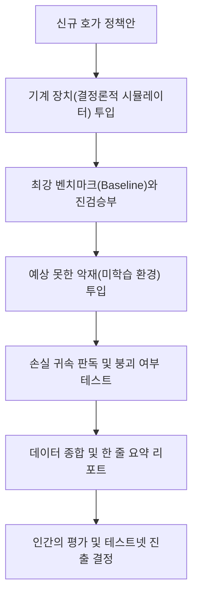

# LIFLUCT 백서

**저자:** [정선철](mailto:zotanika@gmail.com)
**깃헙 저장소:** [https://github.com/zotanika/lifluct](https://github.com/zotanika/lifluct)

## 초록

**[LIFLUCT](https://github.com/zotanika/lifluct)** 는 적대적인 시장 환경에서 유동성 정책이 어떻게 작동하는지 평가하기 위해 구축된 오픈 소스 정책 실험실이다.

이 프로젝트는 다음과 같은 까다로운 질문에서 첫발을 내디뎠다.

> **"자동화된 유동성 시스템이 악의적인 주문 흐름 속에서 호가 정책(Quoting Policy)을 실시간으로 조정한다면, 하나의 전략만 고수하는 마켓 메이커보다 더 나은 성과를 낼 수 있을까?"**

이 질문에 답하기 위해 광범위한 시뮬레이션과 성과 판정(Adjudication) 작업이 진행되었다. 결론부터 말하자면, "적응형 시장 조성"이 무조건적인 승리를 가져다주지는 않았다. 공유된 유동성 위에서 새로운 정책을 실험하는 데 따르는 비용, 가장 취약한 정책을 골라서 집중 타격하는 시장의 구조, 잘 만들어진 고정 정책(Baseline)이 보여주는 강력한 방어력 등 여러 요소를 고려할 때, 단순히 시스템을 "실시간 진화형"으로 만드는 것은 예상보다 훨씬 위험하고 까다로운 일이었다.

현재 LIFLUCT의 목적은 특정 메커니즘이 무조건 돈을 벌어다 준다고 증명하는 것이 아니다. 그보다 훨씬 더 중요한 목표는, "이 유동성 정책이 정말로 우수한가?"라는 주장을 누구나 객관적이고 엄밀하게 검증할 수 있는 무대를 제공하는 것이다. 이를 위해 LIFLUCT는 결정론적 시뮬레이션, 강력한 비교군과의 대조, 최적 고정 정책(Best-fixed Policy) 탐색, 미학습 환경(Out-of-sample) 평가, 손실 귀속의 강건성(Attribution Robustness) 분석, 실패 양상(Failure-mode) 보고, 그리고 대규모 성과 판정 워크플로우를 제공한다.

이 백서는 LIFLUCT 프로젝트가 어디서 출발하여 무엇을 깨달았는지, 현재 어떤 기술적 성취를 이루었는지, 나아가 이 프로젝트의 학술적이고 기술적인 가치가 블록체인 생태계 바깥의 일반 독자들에게도 왜 흥미로운 이야기인지 차근차근 짚어본다.

## 1. 왜 이 프로젝트가 존재하는가

자동화 마켓 메이커(AMM)는 흔히 "간단한 수학 공식 하나로 움직이는 시장"으로 묘사되곤 한다. 하지만 현실은 그렇게 단순하지 않다.

AMM은 유동성 풀(Pool)의 자산을 바탕으로 쉴 새 없이 거래 가격을 산출하는 시스템이다. 유동성 공급자(LP)는 자본을 대고, 트레이더는 이 자본과 거래를 하고, 차익 거래자는 외부 시장과의 가격 차이를 이용해 자신의 이익을 챙기면서 동시에 풀의 가격을 외부와 맞춘다. 정보를 물어오는 오라클(Oracle)은 외부의 기준 가격을 쉴 새 없이 전달한다. 즉, 이 복잡한 경제 시스템의 최종 성적표는 단순한 불변식(Invariant)이나 수수료율표 하나에 의해 결정되지 않는다. 수많은 참여자와 관측된 정보들이 어떻게 상호작용하느냐가 훨씬 중요하다.

이 분야를 처음 접하는 독자라면 다음 세 가지 핵심만 기억해도 좋다.
- AMM은 단순히 수식으로 그려진 곡선이 아니다.
- 그것은 사람들의 자본 위에서 작동하는 '시장 조성 정책'이다.
- 이 정책은 시장 상황에 따라 훌륭할 수도, 형편없을 수도, 외부 공격에 취약할 수도, 튼튼하게 방어적일 수도 있다.

LIFLUCT가 세상에 나온 이유는 이 분야의 많은 연구나 신제품 발표가 여전히 다음과 같은 문제점을 안고 있기 때문이다.
- 허술하게 설정된 경쟁 상대(약한 비교군)
- 자신들에게 유리한 상황에서만 진행된 테스트 결과(In-sample 과최적화)
- 논문 한구석에 숨겨져 있는 불리한 가정들
- 실패 상황에 대한 빈약한 분석 보고
- '적응형(Adaptive)'이니 '지능형(Intelligent)'이니 하는 화려한 수식어에 기댄 마케팅

LIFLUCT는 이런 낭만적인 관행을 밀어내고, 시장 조성을 훨씬 더 엄격하고 냉정한 평가의 영역으로 끌어오려는 시도다.

## 2. 프로젝트의 시작점

LIFLUCT는 꽤 대담한 가설 하나에서 출발했다.

> **"오직 하나의 고정된 전략에만 운명을 맡기는 대신, 거대한 하나의 유동성 풀을 여러 개의 호가 정책 모듈이 나누어 쓰게 만들면 어떨까?"**

어떤 모듈은 수수료를 공격적으로 조정하고, 어떤 모듈은 오라클의 가격 지연을 의심하며 보수적으로 행동하는 식이다. 가장 야심 찬 시나리오는 이들 중 수익을 내지 못하는 약한 정책은 자연스럽게 도태되고, 튼튼한 정책은 복제되며 전체 시스템이 스스로 훈련하고 진화하는 그림이었다.

이러한 직관은 이론적으로 매우 매력적이다.
- 실제 시장 환경은 결코 정적이지 않다.
- 악성 주문 흐름(Toxic Flow)은 일정한 빈도로 찾아오지 않고 갑작스럽게 쏟아진다.
- 고정된 단 하나의 전략은 이런 변화무쌍한 상황에서 너무 뻣뻣하다.
- 스스로 적응하는 유동성 풀은 스트레스가 극심한 환경에서 유동성 공급자의 손실을 획기적으로 줄여줄 것이다.

이 가설이 던진 본질적인 질문은 단순히 특이한 금융 프로토콜을 만들어보자는 것이 아니었다.
"유동성 정책을 실시간으로 적응시키는 구조가 과연 지불할 만한 가치가 있는가? 아니면 인간이 오프라인에서 아주 정교하게 깎아놓은 단 하나의 고정 전략만으로도 충분한 것일까?"

이 질문은 여전히 학술적으로나 실무적으로 큰 가치가 있다. 다만, 이어진 연구 결과는 우리가 처음 기대했던 것과는 전혀 다른 현실을 보여주었다.

## 3. 연구를 통해 얻은 깨달음

### 3.1 실험에는 비용이 따르며, 그 비용은 누군가의 진짜 돈이다
보통의 머신러닝 시스템에서는 새로운 전략을 '탐색'하며 겪는 실패가 컴퓨터 자원의 낭비 정도에 그친다. 하지만 실제 자산이 담긴 유동성 풀 위에서 설익은 정책을 실험하는 것은 완전히 다른 이야기다.

가장 좋은 정책을 찾기 위해 필연적으로 다양한 정책들을 활성화하여 시장에 노출해야 한다면, 시스템은 악의적인 트레이더들에게 뻔히 보이는 먹잇감을 내어주고 그 대가로 데이터를 얻는 셈이다. 이는 유동성 공급자의 대차대조표에 직접적인 마이너스를 긋는 행위다. 살아있는 시장에서 치르는 학습 비용은 오프라인 실험실에서의 학습보다 수천 배 비싸다.

### 3.2 가장 취약한 고리를 노리는 공격은 우연이 아니다
여러 형태의 호가 정책이 하나의 자산을 공유하며 동시에 가격표를 제시한다고 가정해 보자. 정교하고 빠른 사냥꾼들(차익 거래자 등)은 이 정책들을 공평하게 상대해 주지 않는다. 그들은 가장 수비가 허술한 단 하나의 정책만을 골라서 집요하게 타격한다. (가장 얇은 고리를 치는 역학, Weakest-link Dynamics)

이로 인해 심각한 구조적 불균형이 발생한다.
- 우수한 호가 정책을 시스템이 스스로 발견해서 얻는 이득은 느리고 불확실하다.
- 반면, 단 하나의 허술한 호가 정책이 노출되었을 때 겪게 되는 손실은 즉각적이고 파괴적이다.

이러한 특성 때문에 실시간 적응형 유동성 시스템이라는 아이디어에 대한 증명 기준은 아주 가혹해질 수밖에 없다.

### 3.3 훌륭한 기준 모델(Baseline)이 화려한 설명보다 낫다
이 프로젝트가 남긴 가장 큰 수확 중 하나는 방법론에 관한 것이다.

경쟁사에 뒤처지는 구형 시스템을 끌고 와 우리 시스템과 대결시킨 뒤 "우리가 압도적으로 이겼다"고 선언하기는 몹시 쉽다. 하지만 수많은 고정 정책 중에서 컴퓨터로 무수히 계산을 돌려 발굴해 낸 가장 훌륭한 '최적 고정 정책(Best-fixed Policy)'을 상대로 모의고사를 치르게 하면 이야기는 완전히 달라진다.

이 진짜 강한 상대를 링 위로 올리는 순간, 업계에서 떠도는 수많은 야심 찬 논문과 아이디어들이 현실의 벽에 부딪혀 무너지는 것을 지켜보아야 했다. 그래서 LIFLUCT는 가장 훌륭한 고정 정책을 찾아 우리의 비교군으로 삼는 과정을 선택지가 아닌 최우선 의무로 삼는다.

### 3.4 우리의 결론은 현실주의로 선회했다
스스로 진화하는 다중 정책 시스템이라는 원래의 아이디어는 흥미롭지만, 현시점에서 실무자 및 대중과 공유할 수 있는 가장 책임감 있는 결론은 훨씬 보수적이다.

- 실사용자들의 진짜 쌈짓돈 위에서 실시간으로 학습하는 것보다, 오프라인 실험실에서 박 터지게 훈련시킨 정책 하나를 내보내는 것이 훨씬 안전하다.
- 스스로 코드를 바꾸는 인공지능 같은 시스템을 만들기보다, 치명상을 입기 전에 셔터를 내릴 수 있는 ‘안전장치가 도입된 배포(Guarded Deployment)’ 방식을 짜는 편이 책임감 있다.
- 거창한 기술 서사보다는, 때론 지루해 보이더라도 일관되고 혹독한 성과 검증 시스템이 이 시장에 더 절실하다.

지금의 LIFLUCT는 바로 이 실용적이고도 냉정한 결론을 구현해 낸 심판관이다.

## 4. 그래서 현재의 LIFLUCT는 어떤 시스템인가?

LIFLUCT는 당장 내일 고객들의 돈을 쓸어 담을 수 있는 '출시 임박 거래소'가 아니다. 이 소프트웨어만 올리면 무조건 이윤이 남는다고 약속하는 보증 수표도 아니다.

LIFLUCT는 극도로 적대적인 시장 조건 속에서 유동성 정책들의 체력을 측정하고 검증하기 위해 구축된 '전문적인 연구용 실험 도구 모음(Toolkit)'이다.

현재 이 프로젝트의 목표는 아주 명확하다.
"어떤 은행, 프로토콜, 연구자의 유동성 정책이 가장 가혹한 융단폭격을 견뎌내는지, 누구나 투명하게 판정할 수 있도록 돕는다."

단순히 멋진 가설을 논문에 올리는 데 그치지 않고, 정책을 깎고 다듬으며 배포 전 안전함을 점검할 수 있는 실무적인 테스트베드로 진화했다는 사실. 이것이 이 프로젝트가 세상에 내놓는 가장 큰 공헌이다.

## 5. 비전문가를 위한 블록체인 금융 개론

이 분야가 낯선 교양서 독자들을 위해 블록체인 생태계와 자동화 마켓 메이커가 돌아가는 기본 배경을 짚고 넘어가겠다.

### 5.1 블록체인 네트워크란 무엇인가
블록체인 네트워크는 아마존이나 구글의 사설 데이터 센터가 아니라, 전 세계에 흩어진 수많은 컴퓨터가 함께 운영비를 지불하고 장부를 기록하는 거대한 공공 계산기다.

이 네트워크 위에 어떤 경제 시스템이 배포된다는 것은 꽤 무서운 이야기다. 당신이 짠 규칙과 매장 금고가 누구에게나 투명하게 열려 있고, 세계 어딘가에 있는 차익 거래 봇(Bot)들이 하루 24시간, 1000분의 1초 단위로 그 금고의 빈틈을 노린다. 이곳에서 알고리즘 코드는 화이트보드 위의 문자가 아니라 피 튀기는 총성 없는 전쟁터에 투입되는 국지전 지휘관이다.

### 5.2 스마트 컨트랙트란 무엇인가
스마트 컨트랙트(Smart Contract)는 블록체인 위에서 돌아가는 무인 계약 코드다.

AMM에서의 스마트 컨트랙트는 다음과 같은 업무를 수행한다.
- 유동성 풀에 담긴 실제 자산을 누구도 임의로 손대지 못하게 보관한다.
- 수학 공식에 따라 물건의 거래 가격을 제시한다.
- 거래를 체결해 주고 고객의 몫에서 수수료를 뗀다.
- 유동성 공급자, 트레이더, 거래소 간의 자본 이동을 한 치의 오차 없이 집행한다.

이 코드는 한 번 배포되고 나면 아이폰의 앱을 업데이트하듯 조용히 버그를 고치기가 매우 힘들다. 그래서 코드를 네트워크에 올리기 전 평가와 시뮬레이션이 스마트폰 앱 개발보다 수백 배 중요하다.

### 5.3 자동화 마켓 메이커(AMM)란 무엇인가
매수자와 매도자가 각자 부르는 가격들을 리스트업 하던 '오더북(호가창)' 방식을 없애고, 수학 공식이 은행장 역할을 대신하게 만든 거래소 모델이다.

가장 대표적인 '고정곱(Constant Product) 방식'은 두 가지 종류의 자산(예: 사과와 바나나)을 투명한 금고에 듬뿍 쌓아놓고 그 희소성에 따라 가격표가 바뀌도록 만든다.
- 누군가 사과를 왕창 사 가면 금고에는 바나나만 수북하게 쌓이고 사과는 귀해진다.
- 그러면 다음 손님에게 사과를 팔 때, 공식은 자연스럽게 더 비싼 가격을 부른다.
- 만약 우리 금고의 가격 공식이 오작동해서 너무 싸게 팔면? 외부의 전문 차익 거래자들이 눈썹 휘날리게 달려와 싸게 산 물량을 바깥세상에 비싸게 팔아넘긴다. 이들의 활동 덕분에 우리 금고의 물건 비율은 신기하게도 바깥세상의 시세와 똑같이 유지된다.

### 5.4 이 시장의 이해관계자들
알 수 없는 수식들을 걷어내면 시장의 주인공들은 꽤 뚜렷하다.

- 트레이더(Trader): 바나나를 내고 사과를 사 가려는 사용자.
- 유동성 공급자(LP): 거래소가 돌아가도록 초기 쌈짓돈을 금고에 넣어준 전주(錢主)들.
- 차익 거래자(Arbitrageur): 국내외 거래소를 노려보다가 멍청한 가격을 제시하는 곳이 있으면 쏜살같이 낚아채서 수수료 떼어먹는 포효하는 사냥꾼.
- 오라클(Oracle): 바깥세상(나스닥, 바이낸스 등)에서 사과가 지금 얼마에 거래되는지 주기적으로 글로벌 시세를 전달해 주는 전령사.
- 프로토콜(Protocol): 이 플랫폼 자체를 만들고 규칙의 큰 틀을 잡는 재단.

이 모두가 서로의 주머니에서 가장 많은 파이를 가져가기 위해 치열하게 두뇌 싸움을 하는 작은 경제 생태계다.

### 5.5 유동성 공급자는 정말로 불로소득을 누리는가?
절대 그렇지 않다. 이들은 역선택(Adverse Selection)의 위험을 맨몸으로 견뎌내야 하는 사람들이다.

만약 바깥세상의 사과 가격이 폭등했는데, 전령(오라클)이 조금 늦게 도착해서 AMM이 여전히 싼 가격표를 들고 있다고 치자. 가장 발 빠른 차익 거래자가 도착해서 AMM 금고의 싼 사과를 싹쓸이해 간다. LP는 거래당 몇 푼의 수수료는 챙겼겠지만, 창고에 남은 자산들의 총가치를 계산해 보면 이미 엄청난 장부상 손실을 보았다. "수수료율이 높습니다!"라는 말에 속아서는 안 된다. 수수료 수익에서 이런 치명적인 손실들을 다 빼고도 남는 장사인가가 중요하다.

### 5.6 악성 주문 흐름(Toxic Flow)
금융에서 이 '독성'이라는 표현은 나쁘고 부도덕한 도둑질이라는 뜻이 아니다. 구조적으로 우리 금고에 손해만 입히는 독한 매매 패턴을 말한다.

예를 들어:
- 시장 가격이 변할 때 아주 찰나의 지연을 교묘하게 파고드는 매수 버튼
- 오라클 가격이 순간적으로 오류를 일으켰을 때 이를 악용하는 봇
- 우리의 다양한 방어선 중 가장 뚫기 쉬운 곳으로만 폭격을 퍼붓는 행위

이것은 선악의 문제가 아니라 철저한 구조 공학적 스트레스 테스트의 언어다.

### 5.7 오라클(정보망)에 속지 않으려면
우리 금고가 똑똑한 가격표를 걸려면 바깥세상의 '진짜 가격'을 알아야 한다. 그런데 전령(오라클)이 가져오는 가격 정보는 인터넷 지연에 따라 필연적으로 느릴 수 있고, 가끔은 노이즈가 끼거나 심하면 누군가에게 조작당하기도 한다.

이 망가진 오라클의 숫자에 우리 호가 정책이 맹목적으로 의존한다면 어떻게 될까?
- 방어할 필요도 없는데 대문을 닫아걸고(과잉 방어)
- 적이 들이닥치는데도 수수료를 높이지 않거나(과소 반응)
- 멀쩡한 일반 사용자에게 엄청나게 불리한 환율을 강요할 수 있다.

이 때문에 LIFLUCT는 "이 정책은 오라클이 약간 미쳐 돌아갈 때 얼마나 건강하게 버텨내는가?"(강건성)를 부가 기능이 아닌 핵심 심사 기준으로 본다.

### 5.8 실무에서 코드 '배포'가 주는 중압감
소프트웨어 회사에서 배포는 폰트 사이즈를 키우거나 새로운 버튼을 노출하는 가벼운 행사일 수 있다. 하지만 블록체인에서 배포는 경제적 중력의 법칙을 재설정하는 무거운 도장 찍기다.

- 한 번 배포된 스마트 컨트랙트는 모두에게 공개된다.
- 테스트넷의 장난감이 아니라 고객들이 맡긴 수백, 수천억 원의 자금 위에서 돌아간다.
- 코드가 허술하면 유동성은 농담이 아니라 말 그대로 증발하고, 평판은 나락으로 향한다.

그래서 이 백서가 '비상 정지 기준(Rollback Criteria)', '승인 한계(Approval Threshold)' 같은 단어들을 거듭 쓰는 것이다. "이 아이디어 괜찮은걸?" 하는 질문이 아니라 "이 코드를 당신 딸의 통장 잔고 통제권에 연결할 만큼 방어적인가?"를 묻는 프로젝트이기 때문이다.

### 5.9 데브넷, 테스트넷, 메인넷
이 용어들은 서버의 브랜드 이름이 아니라 운영상 '책임의 무게'를 뜻한다.

- 데브넷(Devnet): 대학 연구실에서 연구원들끼리 레고 블록을 조립하며 엔진이 켜지는지 확인하는 단계.
- 테스트넷(Testnet): 세상에 대략적인 모습을 공개하고 가짜 돈을 동원해 한 달간 진행하는 예행연습 무대.
- 메인넷(Mainnet): 진짜 재산과 인센티브, 치명적인 도발이 오가는 실황 무대.

연구실 논문들은 대게 데브넷이나 시뮬레이션에서의 숫자를 메인넷의 영광인 것처럼 포장한다. LIFLUCT는 이 간극을 검증 가능한 데이터로 좁히기 위해 만들어졌다.

## 6. LIFLUCT 시스템 지도

높은 곳에서 내려다보면 LIFLUCT는 호가 정책이라는 까다로운 후보생들을 훈련소에 넣고 채점하는 명확한 파이프라인이다.

### 6.1 현장의 사람들은 어떻게 쓰는가
이 도구가 코딩 천재들만의 오락거리가 아니라 어떤 식의 실무에 쓰이는지 살펴보자.

1. 팀의 수학자가 "이 새로운 공식을 쓰면 방어율 10% 개선이 가능합니다!"라며 문서를 제출한다.
2. 개발팀은 이 공식을 LIFLUCT 시뮬레이터에 태워 주요 벤치마크와 비교한다.
3. 무수히 지독한 환경을 조율해 돌려본 결과 특정 폭락장에서 공식이 완전히 붕괴되는 약점이 발견된다. (고객의 돈을 한 푼도 잃지 않고 문제점을 찾아낸 것이다.)
4. 다른 후보들과 다시 비교하면서 가장 중요한 리스크를 문서화하고, 추가 검토 가치가 있는지 판단한다.
5. 그 다음에야 더 좁은 범위의 외부 테스트로 넘어갈지 논의한다.

요약하자면 이 도구는 예쁜 영업용 차트를 만들어주는 인쇄기가 아니라, 설익은 아이디어들이 무방비하게 야생으로 나가는 것을 막는 견고한 방파제다.

## 7. 시스템의 주요 컴포넌트

### 7.1 결정론적 시뮬레이터
시뮬레이터는 놀이공원처럼 현실의 뼈대를 본떠 기계 장치로 만들어 둔 무대다. 여기에는 시장의 풀, 외부 가격을 외치는 오라클, 일관성 없는 잡음 트레이더들, 그리고 지독하게 틈만 노리는 자객 거래자들이 설정되어 있다.

가장 중요한 건 '결정론적인 움직임'이다. 어제 넣은 조건과 똑같은 수치를 넣으면 오늘도 한 치의 오차 없이 똑같은 결과가 나온다. 이 재현 가능성이 보장되어야만, 손실이 났을 때 이것이 운이 나빴던 것인지 코드가 나빴던 것인지 분석할 수 있다.

### 7.2 최상위 챔피언 찾기 (Best-fixed Policy 탐색)
LIFLUCT는 경쟁 팀의 뒤처진 코드를 복사해 와서 연습 게임을 시키지 않는다. 우리가 설정할 수 있는 단일 정책 공식 중 시스템 한계까지 뽑아낸 가장 단단한 무적의 공식을 스스로 찾아내고, 그것을 허들로 삼는다. "적당히 스마트한 시스템" 대 "강력하게 튜닝된 바보 시스템"이 싸우게 만든다. 여기서 지루한 고정 공식이 의외로 압승을 거두는 경우가 많다. 이 기능은 가장 뼈아프고 정직한 평가를 제공한다.

### 7.3 환경군(Regime Family) 평가
비 내리는 날에 유리한 우산 장수와 해 쨍쨍한 날에 유리한 짚신 장수를 하루만 관찰해선 최고의 장사꾼을 고를 수 없다. LIFLUCT는 가혹한 무대 세팅을 지원한다.

- 정보망이 일부 마비되었을 때
- 시장의 변동성이 미쳐 날뛸 때
- 최악의 빌런들만 접속했을 때
- 우연의 일치를 통제하기 위한 난수 통제 모드까지.

최종 성적표는 단 한 번의 눈부신 성공을 기록하지 않는다. 이 지독한 환경군 릴레이를 모두 통과하며 평균적으로 우상향했는가를 심사한다.

### 7.4 효율적인 기록 관리소(Retention Mode)
10만 번 돌아가는 1년 치 거래 내역을 모두 저장하다간 구글식 서버를 갖춰도 못 버틴다.
가벼운 에포크(epoch) 별 요약 모드, 치명적 버그 시 구간만 집중 해부하는 하이브리드 디버그 모드 등을 지원해 연구진들이 데이터 쓰레기 더미에 깔리지 않고 인사이트에만 집중할 수 있게 해 준다.

### 7.5 종합 리포팅과 단호한 판정
이 복합 단지에서 출력되는 보고서는 광고 전단지와는 180도 다르다. 화려한 브랜드 용어 대신 건조하고 객관적인 학술 언어로 상황을 선고한다.

- 생존함 (Survives)
- 성과가 엇갈림 (Mixed)
- 붕괴 실패 (Fails)
- 판단 보류 (Inconclusive)

이 단호함은 어떤 현란한 수식 앞에서도 동요하지 않는 LIFLUCT의 정체성이다.

## 8. 핵심 방법론의 철학

### 8.1 흔들리지 않는 비교 대조군(Baseline Discipline)
많은 혁신적 논문들이 자신의 영리함을 증명하기 위해 낡은 시스템과 편하게 대결한다. 하지만 LIFLUCT는 매우 공격적으로 조율된 '최강 벤치마크 고정 모델'을 강제 배치한다. 기초를 넘지 못한 모델은 탈락이다.

### 8.2 똑같이 잔인한 무대 제공 (공정성)
여러 모델을 비교하려면 변동성, 악당들의 활동량, 난수 생성기 등 모든 조건을 거울처럼 똑같이 반영해야 한다. 그래야 모델의 우위를 순수하게 평가할 수 있다.

### 8.3 시험지 분출 방지(Train/test 분리)
자신이 학습한 2024년 2월의 시장 데이터로 학습된 봇을, 2024년 2월의 시장에 투입하면 당연히 상위 1%의 수익이 발생한다. LIFLUCT는 이 봇을 2025년의 완전히 새로운 국면으로 강제로 밀어 넣어 '가짜 만점자(변수 끼워 맞추기)'를 색출해 낸다.

### 8.4 손해는 진짜 누구 탓인가? (손실 귀속 강건성)
손해율 계산은 주관에 빠지기 쉽다. 기준 가격을 현재 외부가로 할지, 5분 평균가로 할지, 거래 체결 10초 후를 기준으로 할지에 따라 순위가 요동친다면 그 시스템은 강건하지 못한 것이다. LIFLUCT는 다양한 각도에서 산출한 기준을 들이대며 흔들리지 않는지 크로스 체크를 진행한다.

### 8.5 실패 우선 보고제 (Failure-first Reporting)
LIFLUCT에게 치명적인 실패(가동 중단, 잔고 붕괴)는 오답 노트보다 더 귀중한 '광산의 카나리아'다. 
수수료가 허공에 증발한 상황, 너무 방어적으로 굴다가 거래 파이가 아예 죽어버린 무덤 상태 등 최악의 적신호들이 빨갛게 점멸하도록 보고서 첫 장에 박제하여 설계자들이 현실을 마주하게 만든다.

## 9. 실적의 잣대들 (주요 지표)

수학 기호를 제외하고 우리가 따지는 돈의 흐름은 이렇다.

### 9.1 가격 괴리율
"시장의 실제 가치와 우리 금고의 가격표가 몇 % 벌어졌는가?" 절대값으로 그 긴급성을 계산한다.

### 9.2 수수료의 동적 조절
단순하다. 위의 수식에서 시장의 괴리가 너무 급격히 벌어지면, 방어막처럼 차익 거래 수수료를 훅 올려서 도둑질을 막는다.

### 9.3 사용자들의 체감 불쾌감 (대체 지표)
거래소는 튼튼해지는데 선량한 트레이더들이 거래 시 너무 빡빡한 체결률이나 비싼 수수료를 낸다면 매력 없는 거래소다. 방어율이 오를 때 트레이더들의 슬리피지와 수수료가 얼마나 치솟았는가 균형감을 측정한다.

### 9.4 존버 vs 마켓 메이킹 (LP 순수익)
유동성을 대준 전주(LP)가 1년 내내 사과와 바나나를 집에 고이 모셔놨을 때와, 이 시스템에 1년 동안 내어주고 온풍과 한파를 겪게 한 뒤 남은 가치를 무자비하게 비교한다.

## 10. 기술적 기여

엔지니어 입장에서도 훌륭한 산출물이다.

### 10.1 레고 블록식 구조
정보 전달, 거래 룰, 손실 정산과 기록계 등이 모듈식으로 철저하게 나뉘었다. 하나의 코드를 바꾼다고 엉뚱한 곳에서 버그가 튀어나오는 비극을 줄여준다.

### 10.2 막강한 오토메이션 플랜트
수만 가지의 세팅을 지닌 모의 무대를 다수의 서버에 흩뿌리고 병렬 계산을 진행한 뒤 압축 요약본으로 결과만 받아보는 탄탄한 테스트 공정이 들어있다.

### 10.3 순정 텍스트 보고서(Markdown)
화려한 그래프 UI 하나 띄워주고 그 이면의 데이터를 잠궈버리는 대신, 텍스트 형태의 솔직하고 검수하기 편한 마크다운 문서를 쏟아낸다. 이를 깃허브 같은 생태계 개발 플랫폼에 곧장 공유하며 다른 학자들의 공개 평문을 이끌어 낸다.

## 11. 학술적 기여

학술적으로도 흥미로운 변화가 있다.

### 11.1 수식의 우아함보다 맷집을 측정
학계는 종종 우아한 마켓 메이킹 수식에 이끌리는 경향이 있다. LIFLUCT는 담담하게 묻는다. "그래서 이 수식이 사방에서 터지는 악성 트래픽을 맞으면서 오라클 정보가 끊길 때도 안 죽고 버팁니까?"

### 11.2 실패 사례의 양지화
블록체인 커뮤니티에는 수많은 프로토콜 메커니즘 붕괴 일화들이 은밀하게 떠돌 뿐이다. 이 스택은 코드의 한계를 양지에 올리고 투명하게 소통하는 것을 모범 답안으로 격상시킨다.

### 11.3 실체 없는 직관들을 눈으로 보여주다
"역선택, 독성 트래픽, 오라클 해킹..." 구전처럼 떠도는 이야기나 수치로 표현하기 힘든 부조리들을 시뮬레이션 환경의 실체적인 데이터 코드로 변환해 버렸다. 과학수사대의 재현 현장과도 같은 성과다.

## 12. 프로젝트의 현주소

LIFLUCT는 더 이상 노트북 속 구상이나 논문을 위한 예시 프로그램이 아니다.

방대한 배치 시스템, 단단한 베이스라인 경쟁 구조, 리포팅 프레임워크를 갖춘 '유동성 정책 전용 평가 소프트웨어'로 거듭났다. 골치아픈 복잡성을 배제하고 우아한 수식을 만들어 내기 위한 샌드박싱에서 벗어나, "그 수식이 얼마나 현실로부터 괴리되어 있는지" 기막히게 잡아내는 강력한 탐지기가 구축되어 있다는 점. 이것이 프로젝트의 확고한 마일스톤이다.

## 13. 누가 이 도구의 열쇠를 쥐어야 하는가

이 연구소의 쓰임처는 생각보다 넓다.

### 13.1 학자 및 메커니즘 연구자
유명 대학이나 재단의 매력적인 논문 발표가 있을 때, 그 코드를 이 랩실에 물려 흠결이 없는지 재현 실험을 하고 과장된 주장을 하지는 않는지 걸러낼 수 있다.

### 13.2 프로토콜 인프라팀 및 재무 팀
천재가 만든 수식이라도 세상에 '배포' 결정을 내리는 것은 실무 팀의 몫이다. 최악의 시나리오 무대에 올려 언제쯤 가동을 중단하는 게 맞는지 방파제를 설계할 책임 있는 증거 자료가 필요하다.

### 13.3 생태계의 비판적 독자들
일명 '코인 시장'이 성숙해지기 위해 허황된 서사에 속지 않는 지성인들이 많아져야 한다. 이 도구는 그들을 무장시키는 지적인 저격총이 된다.

## 14. 우리가 절대 약속하지 않는 것

가장 중요한 항목이다. LIFLUCT는 아래와 같이 선을 긋는다.

- 손실액 계산 방식은 진리가 아니며 우리만의 근삿값일 뿐이다.
- 우리 시뮬레이터 안의 악당이 현실 최고의 해커보다 치밀하다고 장담하지 않는다.
- 우리 연구소에서 1등을 달성한 모델이 다음날 출시되어 돈방석을 약속하는 것도 전혀 아니다.

우리는 암흑시대의 불확실성을 완전히 소거할 수 있다고 말하지 않는다. 하지만, 깜깜하던 지하실에서 비상구 구조를 조금이라도 그려볼 수 있는 견고한 횃불을 손에 쥐었음에는 자부심을 가진다.

## 15. 이후의 설계도

개발자들의 다음 계획표는 담백하다.

### 15.1 모두가 쓰기 편하게 포장하기
비전공 학부생도 돌려볼 수 있을 만큼 문서를 가다듬고 친절한 클릭 예제들을 탑재해 진입 장벽을 수면 이하로 낮출 것이다.

### 15.2 더 독한 비교군 만들기
우리의 가장 단단한 고정 심사위원(Best Fixed Search)의 탐색기 성능을 높여 도전자들의 멘탈을 더 강력하게 부수도록 조치한다.

### 15.3 모두를 향해 열려있기
우리의 방법론조차 비판받아 수정될 수 있도록 투명한 데이터 출력에 온 힘을 기울일 것이다. 닫혀있는 금고 안의 진리가 아닌 공터 위의 난상토론 구조를 선호한다.

## 16. 백서를 닫으며

LIFLUCT는 우아한 기술적 모형을 냉철하게 평가하는 과정을 통해 정제해 낸 지난한 궤적의 산물이다.

이 프로젝트가 세상에 던지는 무기는 아름다운 황금 수익률이 아니다. 부실한 가설 위 지어진 모래성 논문들과 과장된 환상들을 남김없이 부수고 가혹한 질문을 들이미는 날카롭고 견고한 수술대다.

블록체인 생태계와 탈중앙화 금융이 진정으로 신뢰받는 날을 원한다면, 부적격한 아이디어들이 살아남지 못하게 숨겨진 비용을 까발리는 성가신 검증관이 더 많이 배출되어야 한다. 

LIFLUCT는 바로 그런 도구들을 생태계에 심기 위한 담대한 시작이다.

---

## 부록 A. 짧은 용어집

### 자동화 마켓 메이커 (AMM)
호가창과 중개인 없이 투명한 금고(풀)에 예치된 자산 비율에 따라 알고리즘이 수학적으로 가격을 고시하는 자동 교환소.

### 유동성 공급자 (LP)
위탁 자산을 금고에 제공하는 주주들. 수수료를 돌려받지만 자산 증발 리스크에 제일 노출되어 있다.

### 오라클 (Oracle)
블록체인 바깥세상의 실제 시세를 거래소에 전달하는 우편 배달부. 때론 느리고 때론 조작당할 수 있다.

### 스마트 컨트랙트
배포되면 누구도 임의로 수정, 번복, 변조할 수 없는 체인상의 무관용 계약 코드.

### 악성 트래픽 (Toxic Flow)
시장 변동이나 가격 시차의 허점을 틈타 거래소에 지독한 손해를 입히는 특수한 차익 거래 주문. 악의적인 해커가 아니라 합리적 구조의 산물이다.

### 최적 고정 정책 (Best-fixed Policy)
수많은 룰 속에서 찾아낸 가장 단단하고 방어력이 높은 단일 공식. 평가의 핵심 넘버원 기준점이 된다.

### 손실 귀속의 강건성 (Attribution Robustness)
손실을 계산하는 방식이나 측정 타이밍을 이리저리 비틀어봐도 최종 성적이나 등수가 안정적으로 유지되는 방어력.

### 붕괴 (Lysis)
스트레스 상황에서 구조적으로 위험해 보이는 정책을 뒤로 미루거나 비활성화하기 위해 적절히 조정된 보호 장치를 가리키는 표현.

### 배포 (Deployment)
문서 속 아이디어를 메인 컴퓨터에 올리는 일. 블록체인 상에서는 곧 수백억 대의 총성 없는 코인 전쟁터에 금고를 통째로 던져놓는 행위와 같다.

## 부록 B. 독자에게 드리는 약속

다른 기술 백서들보다 유독 직설적인 어조로 글을 이어간 이유는 이 주제가 그만큼 환상에 잡아먹히기 쉬운 분야이기 때문이다.
본 문서를 덮은 뒤 독자 여러분의 머릿속에 아래 세 줄이 확실하게 남아있기를 바란다.

1. 탈중앙 거래소 시스템은 기계처럼 돌아가는 단순한 수학 공식이 아니라, 언제든 돈을 잃을 수 있는 방어 '정책'의 묶음이다.
2. 환상적인 마케팅이나 논문상의 수익 지표보다 가혹하게 조율된 정직한 모의고사 성적이 수백 배 더 이롭다.
3. LIFLUCT는 세상에 떠도는 여러 수식들이 얼마나 엉성한지 검증하기 위해 태어난 심판관이자 공공 현미경이다.